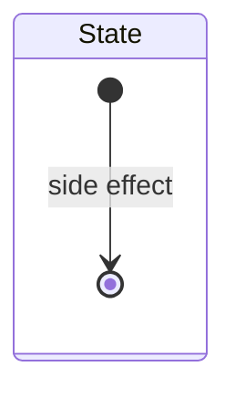
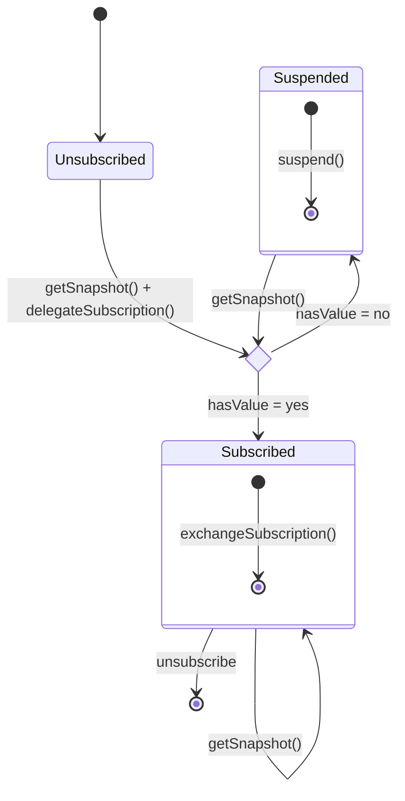

# Mental Model: Exchange

## Side Effects

Any state of the following form performs a side effect as the initial transition
when entering such state:

## Subscription Exchange

Instead of subscribing on render, subscriptions are delegated to some ancestor
component, and then exchanged once the component using the store renders.

