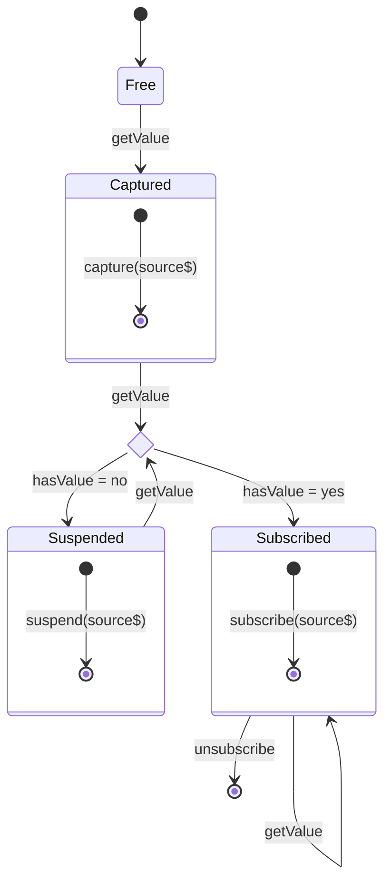

# Mental Model

## Free

A state in which the store's source is is "Free"
from any subscription boundary: no subscriptions
to the source have been captured.

- The only transition allowed in this state is "getValue".
- In the "Free" state the store is not subscribed to the source.
- The only legal state to transition from "Free"

## Captured

Transitioning to "Captured" produces a side
effect that signals an instruction to "capture"
the source of the store in some upstream
subscribe boundary.
